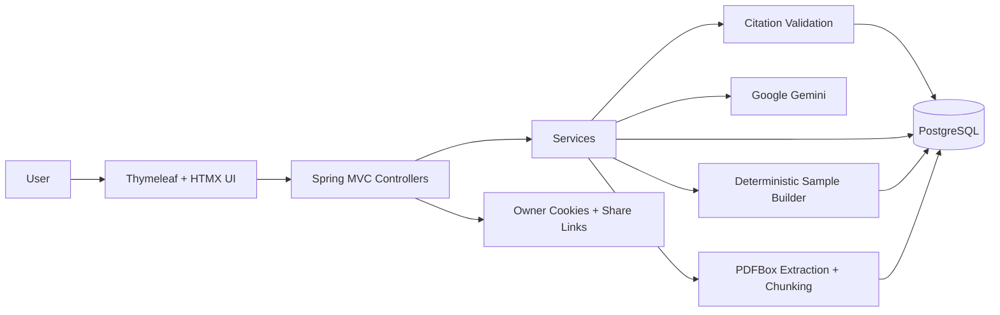

# PolicyInsight

## What this is

PolicyInsight is a Spring Boot web app for reviewing policy, agreement, and contract PDFs. Users upload a PDF, the app extracts text with PDFBox, creates source sections, generates a structured report, validates citations back to source text, and supports shareable report links plus grounded Q&A for uploaded documents. It also includes a bundled deterministic sample report built from a committed fictional PDF so the demo path does not depend on live Gemini availability.

## Problem it solves

Reviewing contracts and policy documents manually is slow when the goal is to identify the operational terms quickly. This app reduces that friction by extracting the text, organizing the document into source sections, producing a readable report with cited evidence, and allowing follow-up questions against the uploaded document instead of forcing users to scan the full PDF by hand.

## Features

- Upload PDF documents, validate them, extract text with PDFBox, and split the text into source sections without storing the original file
- Generate structured reports for uploaded documents, then validate cited sources before saving the final report
- Open a deterministic Gemini-free sample report built from `src/main/resources/samples/fictional_business_agreement.pdf`
- Create shareable report links and ask grounded Q&A questions for uploaded documents

## Tech stack

Frontend: Thymeleaf and HTMX

Backend: Java 21 and Spring Boot

Database: PostgreSQL with Flyway migrations

AI/API: Google Gemini or local mock analysis

Authentication: Owner access cookies, expiring share links, and simple in-memory rate limiting

Deployment: Docker and Render

Other tools: PDFBox, Maven Wrapper, H2 for normal tests, Docker Compose for local PostgreSQL, and Testcontainers for optional PostgreSQL integration tests

## Setup

### 1. Clone the repo

```bash
git clone https://github.com/ChimdumebiNebolisa/policy-insight.git
cd policy-insight
```

### 2. Install dependencies

This project uses Java 21, Docker for local PostgreSQL, and the Maven Wrapper for builds and tests. You do not need npm for this app.

```powershell
docker compose up -d
.\mvnw.cmd test
```

### 3. Add environment variables

Environment variables used by this app:

```text
DATABASE_URL
APP_TOKEN_SECRET
APP_AI_PROVIDER
GEMINI_API_KEY
GEMINI_MODEL
GEMINI_TIMEOUT_SECONDS
APP_UPLOAD_MAX_BYTES
APP_OWNER_TOKEN_TTL_MINUTES
APP_SHARE_TTL_DAYS
APP_CLEANUP_ENABLED
APP_RETENTION_COMPLETED_DAYS
APP_RETENTION_FAILED_DAYS
APP_RETENTION_EXPIRED_SHARE_DAYS
APP_JOB_STALE_MINUTES
APP_CLEANUP_FIXED_DELAY_MS
```

Local mock mode for Windows PowerShell:

```powershell
$env:SPRING_DATASOURCE_URL="jdbc:postgresql://localhost:55432/policyinsight"
$env:SPRING_DATASOURCE_USERNAME="policyinsight"
$env:SPRING_DATASOURCE_PASSWORD="policyinsight"
$env:APP_TOKEN_SECRET="replace-with-a-long-random-secret-that-is-not-short"
$env:APP_AI_PROVIDER="mock"
```

Production Gemini mode:

```text
DATABASE_URL=<Render internal Postgres URL>
APP_TOKEN_SECRET=<long random secret>
APP_AI_PROVIDER=gemini
GEMINI_API_KEY=<your Gemini key>
GEMINI_MODEL=gemini-2.5-flash-lite
GEMINI_TIMEOUT_SECONDS=180
APP_UPLOAD_MAX_BYTES=10485760
APP_OWNER_TOKEN_TTL_MINUTES=120
APP_SHARE_TTL_DAYS=7
APP_CLEANUP_ENABLED=true
APP_RETENTION_COMPLETED_DAYS=30
APP_RETENTION_FAILED_DAYS=7
APP_RETENTION_EXPIRED_SHARE_DAYS=0
APP_JOB_STALE_MINUTES=30
APP_CLEANUP_FIXED_DELAY_MS=3600000
```

Recommended production values:

- `APP_AI_PROVIDER=gemini`
- `GEMINI_MODEL=gemini-2.5-flash-lite`
- `GEMINI_TIMEOUT_SECONDS=180`

Recommended local value:

- `APP_AI_PROVIDER=mock`

Render note:

Render free instances can be slow or cold-started, so the deployed app worked more reliably with `GEMINI_MODEL=gemini-2.5-flash-lite` and `GEMINI_TIMEOUT_SECONDS=180` instead of a heavier model and shorter timeout.

Important local note:

The Docker Compose PostgreSQL host port is `55432`, not `5432`, because a local Windows PostgreSQL installation may already be using `5432`.

### 4. Run the app locally

Start PostgreSQL:

```powershell
docker compose up -d
```

Run the app:

```powershell
.\mvnw.cmd spring-boot:run
```

Open the local URL shown in the terminal, typically `http://localhost:8080`.

## Testing

Run normal tests:

```powershell
.\mvnw.cmd test
```

Run optional PostgreSQL integration tests with Testcontainers:

```powershell
.\mvnw.cmd verify -Pintegration-tests
```

The integration profile uses Docker to start PostgreSQL and verify Flyway/schema behavior against the real database engine. Normal `.\mvnw.cmd test` does not require Docker.

What is tested:

- application context
- repositories and Flyway migrations
- PDF extraction
- sample report path
- citation validation
- upload flow and async status polling
- share links
- Q&A behavior
- cleanup behavior
- JSON job status API
- Gemini error handling where covered

## Endpoints

PolicyInsight is primarily a server-rendered Thymeleaf/HTMX app. Most endpoints return full HTML pages or HTML fragments, not JSON REST responses.

Browser pages:

- `GET /`: full landing/upload page
- `GET /report/{reportId}`: owner-only report page
- `GET /shared/{token}`: read-only shared report page
- `GET /sample` or `GET /sample-report`: sample report redirect
- `GET /health`: lightweight deployment health check

HTMX fragments:

- `POST /upload`: multipart PDF upload; creates a job and starts in-process async report generation
- `GET /status/{jobId}`: owner-only status fragment
- `POST /share/{reportId}`: owner-only share-link fragment
- `POST /qa/{reportId}`: owner-only Q&A answer fragment

Small JSON API:

- `GET /api/jobs/{jobId}/status`: owner-only job status JSON using the same owner cookie as `/status/{jobId}`

Example:

```powershell
curl.exe -i http://localhost:8080/api/jobs/<jobId>/status --cookie "PI_OWNER_<job>=<owner-token>"
```

Response:

```json
{
  "jobId": "uuid",
  "status": "UPLOADED|TEXT_EXTRACTED|BUILDING_AI_REPORT|VALIDATING_CITATIONS|PROCESSING|COMPLETED|FAILED",
  "reportId": "uuid-or-null",
  "message": "safe user-facing status message",
  "createdAt": "timestamp",
  "updatedAt": "timestamp"
}
```

## How it works

For this project:

1. User uploads a PDF.
2. Backend validates and extracts text with PDFBox.
3. Extracted text is split into source sections.
4. Analyzer generates a structured report asynchronously.
5. Citation validation checks referenced sources.
6. User views, shares, or asks questions against uploaded reports.

The sample report path is separate from uploaded analysis. It loads the committed fictional PDF at `src/main/resources/samples/fictional_business_agreement.pdf`, uses a deterministic report builder, does not use Gemini, and does not show Q&A.

## Architecture

Key directories:

```txt
src/main/java/com/policyinsight/      Application code
src/main/resources/templates/         Thymeleaf pages and fragments
src/main/resources/static/            CSS assets
src/main/resources/samples/           Bundled deterministic sample PDF
src/main/resources/db/migration/      Flyway migrations
src/test/                             Test suite
```



System overview:

- `Frontend`: Server-rendered Thymeleaf pages with HTMX for upload submission, status polling, share-link fragments, and Q&A partial updates.
- `Backend`: Spring Boot handles PDF validation, text extraction, chunking, async report generation, citation validation, report access, share links, Q&A, and scheduled cleanup.
- `Database`: PostgreSQL stores jobs, extracted source chunks, reports, share links, and saved Q&A interactions.
- `External services`: Google Gemini is used for uploaded-document analysis and uploaded-document Q&A when `APP_AI_PROVIDER=gemini`.
- `Deployment`: The app is packaged as a Dockerized Spring Boot service and deployed to Render with a Postgres database and `/health` health check.

## Retention and cleanup

- Original PDFs are discarded after text extraction, but extracted chunks, reports, Q&A history, jobs, and share-link hashes are stored in PostgreSQL.
- Scheduled cleanup is enabled by default and runs in-process on a fixed delay.
- Expired share links are deleted after `APP_RETENTION_EXPIRED_SHARE_DAYS`.
- Non-demo in-progress jobs older than `APP_JOB_STALE_MINUTES` are marked `FAILED` with a safe timeout message. They are not retried automatically.
- Non-demo failed jobs older than `APP_RETENTION_FAILED_DAYS` and completed jobs older than `APP_RETENTION_COMPLETED_DAYS` are deleted from `policy_jobs`; database cascades remove related chunks, reports, Q&A, and share links.
- Demo/sample jobs are preserved by excluding rows with a non-null `demo_key`.
- Because cleanup is in-process, it only runs while the app is up and is not a substitute for a durable background worker.

## Security notes

- Uploaded PDFs are read in memory for text extraction and are not stored.
- Direct report pages require the owner cookie created during upload or sample report creation.
- Public report access is only through `/shared/{token}`.
- Share tokens are generated with `SecureRandom`; only HMAC hashes are stored.
- AI and user-generated text is rendered through escaped Thymeleaf expressions.
- Upload and Q&A are protected with simple in-memory per-IP rate limiting. This resets on restart and is per app instance, so use shared rate limiting before scaling horizontally.
- Citation validation verifies that cited chunk IDs exist for the document. It does not prove semantic support inside the cited chunk.
- Live Gemini mode rejects the default or short `APP_TOKEN_SECRET`.

## Known limitations

- Render free instances may be slow or cold start.
- Live Gemini analysis depends on valid Gemini credentials and may timeout if model or timeout settings are misconfigured.
- Citation validation is source-reference based, not deep semantic proof.
- Uploaded PDFs are not malware-scanned.
- In-memory rate limiting is MVP-level and resets on restart.
- Async report generation and cleanup are in-process, not durable external workers.
- The sample report is a deterministic demo path for one bundled fictional document, not a live analysis run.

## Useful Commands

```powershell
.\mvnw.cmd test
.\mvnw.cmd verify -Pintegration-tests
.\mvnw.cmd spring-boot:run
docker compose up -d
docker compose down
```

## License

MIT License. See [LICENSE](LICENSE).
